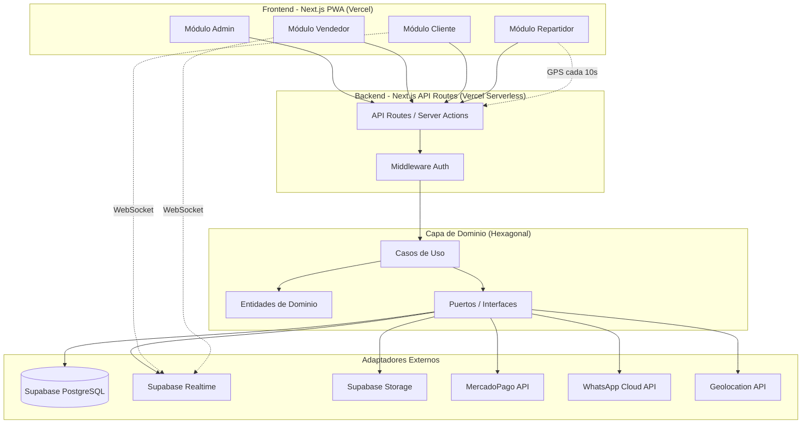
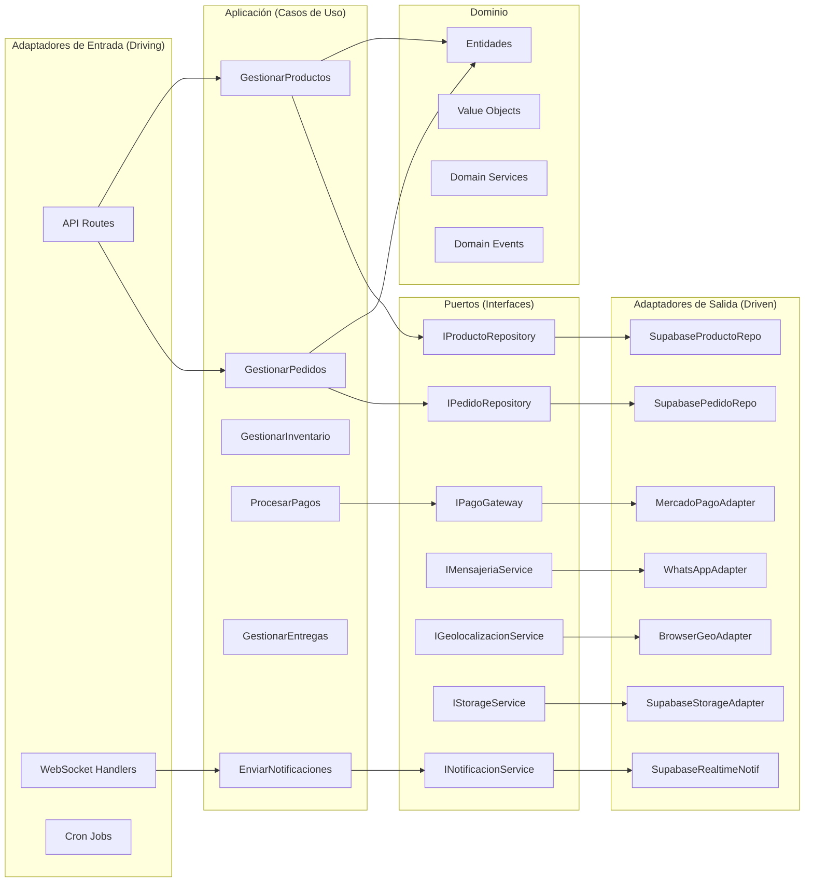
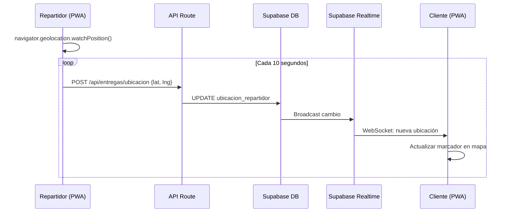
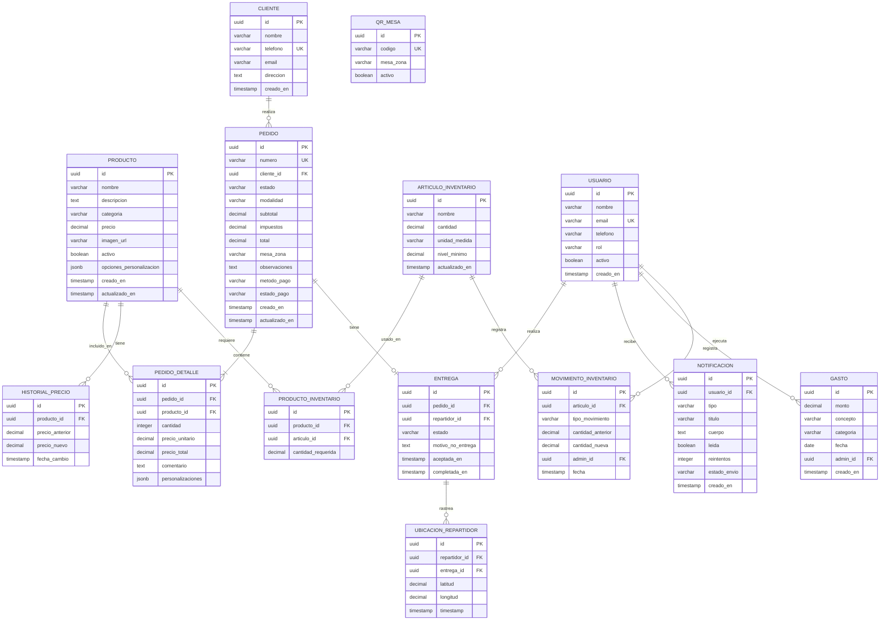
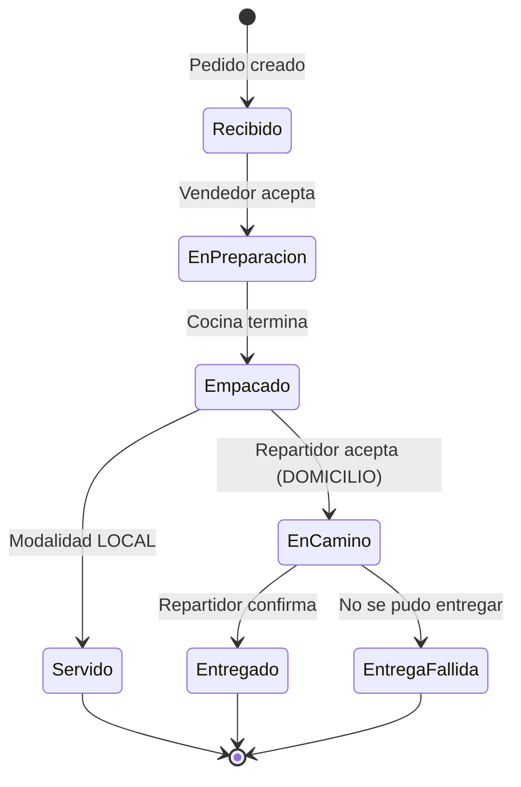

# Documento de Diseño - Sistema de Gestión Wings & Burgers

## Overview

Este documento describe el diseño técnico del sistema integral de gestión para un negocio de alitas y hamburguesas. El sistema se compone de cuatro módulos principales (Administración, Vendedor, Cliente y Repartidor) implementados como una aplicación monolítica modular con arquitectura hexagonal, desplegada sobre servicios de infraestructura gratuita o de muy bajo costo.

### Decisiones Clave de Diseño

| Decisión | Elección | Justificación |
|----------|----------|---------------|
| Framework Frontend | Next.js 14+ (App Router) | SSR, PWA nativo, API Routes integradas, despliegue gratuito en Vercel |
| Base de Datos | Supabase (PostgreSQL) | Tier gratuito con 500MB, Realtime integrado, Auth, Storage |
| Hosting | Vercel (Hobby Plan) | Gratuito, serverless, edge functions, ideal para Next.js |
| Tiempo Real | Supabase Realtime | WebSockets incluidos en tier gratuito, broadcast y presence |
| Pagos | MercadoPago SDK Node.js | SDK oficial, Checkout Pro para redirección segura |
| WhatsApp | Meta WhatsApp Cloud API | API gratuita (solo se paga por mensajes template entregados) |
| Almacenamiento | Supabase Storage | 1GB gratuito, CDN integrado para imágenes de productos |
| Mapas | Leaflet + OpenStreetMap | Gratuito, sin límites de uso, ideal para rastreo GPS |
| PWA | next-pwa / Workbox | Service workers para offline y notificaciones push |
| Estilos | Tailwind CSS | Utility-first, tematización sencilla, bundle optimizado |

### Estimación de Costos Mensuales

| Servicio | Costo | Notas |
|----------|-------|-------|
| Vercel Hobby | $0 | Hosting, serverless functions, dominio *.vercel.app |
| Supabase Free | $0 | 500MB DB, 1GB storage, 50K MAU, Realtime |
| WhatsApp Cloud API | ~$0-3 | Solo se cobra por mensajes template (~$0.03/msg) |
| Dominio (opcional) | ~$1-2 | Si se desea dominio personalizado |
| **Total estimado** | **$0 - $5 USD** | Dentro del presupuesto de $10 USD |

---

## Architecture

### Diagrama de Arquitectura General



### Arquitectura Hexagonal - Estructura de Capas



### Estructura de Directorios

```
src/
├── domain/                          # Capa de Dominio (núcleo)
│   ├── entities/                    # Entidades del negocio
│   │   ├── Producto.ts
│   │   ├── Pedido.ts
│   │   ├── Cliente.ts
│   │   ├── Inventario.ts
│   │   ├── Gasto.ts
│   │   └── Entrega.ts
│   ├── value-objects/               # Value Objects
│   │   ├── Precio.ts
│   │   ├── Telefono.ts
│   │   ├── Direccion.ts
│   │   └── EstadoPedido.ts
│   ├── ports/                       # Interfaces (Puertos)
│   │   ├── repositories/
│   │   │   ├── IProductoRepository.ts
│   │   │   ├── IPedidoRepository.ts
│   │   │   ├── IClienteRepository.ts
│   │   │   ├── IInventarioRepository.ts
│   │   │   └── IGastoRepository.ts
│   │   └── services/
│   │       ├── IPagoGateway.ts
│   │       ├── IMensajeriaService.ts
│   │       ├── INotificacionService.ts
│   │       ├── IStorageService.ts
│   │       └── IGeolocalizacionService.ts
│   ├── services/                    # Domain Services
│   │   ├── PrecioService.ts
│   │   ├── InventarioService.ts
│   │   └── CorteService.ts
│   └── events/                      # Domain Events
│       ├── PedidoCreado.ts
│       ├── EstadoPedidoCambiado.ts
│       └── InventarioBajo.ts
├── application/                     # Capa de Aplicación (Casos de Uso)
│   ├── use-cases/
│   │   ├── productos/
│   │   │   ├── CrearProducto.ts
│   │   │   ├── EditarProducto.ts
│   │   │   └── EliminarProducto.ts
│   │   ├── pedidos/
│   │   │   ├── CrearPedido.ts
│   │   │   ├── ActualizarEstadoPedido.ts
│   │   │   ├── AgregarProductoAPedido.ts
│   │   │   └── ConfirmarPedido.ts
│   │   ├── inventario/
│   │   │   ├── RegistrarArticulo.ts
│   │   │   ├── ActualizarCantidad.ts
│   │   │   └── VerificarDisponibilidad.ts
│   │   ├── pagos/
│   │   │   ├── IniciarPagoMercadoPago.ts
│   │   │   ├── ConfirmarPago.ts
│   │   │   └── VerificarComprobante.ts
│   │   ├── entregas/
│   │   │   ├── AceptarEntrega.ts
│   │   │   ├── ActualizarUbicacion.ts
│   │   │   └── CompletarEntrega.ts
│   │   ├── gastos/
│   │   │   ├── RegistrarGasto.ts
│   │   │   └── ConsultarGastos.ts
│   │   ├── cortes/
│   │   │   └── GenerarCorte.ts
│   │   └── notificaciones/
│   │       ├── NotificarNuevoPedido.ts
│   │       ├── NotificarCambioEstado.ts
│   │       └── EnviarCuentaCliente.ts
│   └── dtos/                        # Data Transfer Objects
│       ├── ProductoDTO.ts
│       ├── PedidoDTO.ts
│       └── CorteDTO.ts
├── adapters/                        # Capa de Adaptadores
│   ├── driven/                      # Adaptadores de Salida
│   │   ├── persistence/
│   │   │   ├── supabase/
│   │   │   │   ├── SupabaseClient.ts
│   │   │   │   ├── SupabaseProductoRepo.ts
│   │   │   │   ├── SupabasePedidoRepo.ts
│   │   │   │   ├── SupabaseClienteRepo.ts
│   │   │   │   ├── SupabaseInventarioRepo.ts
│   │   │   │   └── SupabaseGastoRepo.ts
│   │   │   └── mappers/
│   │   │       ├── ProductoMapper.ts
│   │   │       └── PedidoMapper.ts
│   │   ├── payment/
│   │   │   └── MercadoPagoAdapter.ts
│   │   ├── messaging/
│   │   │   ├── WhatsAppAdapter.ts
│   │   │   └── EmailAdapter.ts
│   │   ├── storage/
│   │   │   └── SupabaseStorageAdapter.ts
│   │   ├── notification/
│   │   │   └── SupabaseRealtimeAdapter.ts
│   │   └── geolocation/
│   │       └── BrowserGeoAdapter.ts
│   └── driving/                     # Adaptadores de Entrada
│       ├── api/                     # Next.js API Routes
│       │   ├── productos/
│       │   ├── pedidos/
│       │   ├── inventario/
│       │   ├── pagos/
│       │   ├── entregas/
│       │   └── webhooks/
│       └── realtime/
│           └── RealtimeHandler.ts
├── app/                             # Next.js App Router (UI)
│   ├── (admin)/                     # Módulo Administrador
│   │   ├── productos/
│   │   ├── precios/
│   │   ├── gastos/
│   │   ├── inventario/
│   │   ├── cortes/
│   │   └── clientes/
│   ├── (vendedor)/                  # Módulo Vendedor
│   │   ├── pedidos/
│   │   └── cuenta/
│   ├── (cliente)/                   # Módulo Cliente
│   │   ├── menu/
│   │   ├── pedido/
│   │   ├── pago/
│   │   └── rastreo/
│   ├── (repartidor)/                # Módulo Repartidor
│   │   ├── entregas/
│   │   └── mapa/
│   └── api/                         # API Routes (adaptadores driving)
│       ├── productos/
│       ├── pedidos/
│       ├── webhooks/
│       │   ├── mercadopago/
│       │   └── whatsapp/
│       └── realtime/
├── shared/                          # Utilidades compartidas
│   ├── config/
│   ├── errors/
│   ├── validators/
│   └── types/
└── tests/
    ├── unit/
    │   ├── domain/
    │   └── application/
    ├── property/
    │   └── domain/
    └── integration/
        └── adapters/
```

---

## Components and Interfaces

### Puertos del Dominio (Interfaces)

#### IProductoRepository

```typescript
interface IProductoRepository {
  crear(producto: Producto): Promise<Producto>;
  actualizar(id: string, datos: Partial<Producto>): Promise<Producto>;
  desactivar(id: string): Promise<void>;
  obtenerPorId(id: string): Promise<Producto | null>;
  listarActivos(filtros?: FiltroProducto): Promise<Producto[]>;
  listarPorCategoria(categoria: Categoria): Promise<Producto[]>;
}
```

#### IPedidoRepository

```typescript
interface IPedidoRepository {
  crear(pedido: Pedido): Promise<Pedido>;
  actualizar(id: string, datos: Partial<Pedido>): Promise<Pedido>;
  obtenerPorId(id: string): Promise<Pedido | null>;
  obtenerPorNumero(numero: string): Promise<Pedido | null>;
  listarPorEstado(estado: EstadoPedido): Promise<Pedido[]>;
  listarPorCliente(clienteId: string, paginacion: Paginacion): Promise<PedidoPaginado>;
  listarPorPeriodo(inicio: Date, fin: Date): Promise<Pedido[]>;
  contarPorPeriodo(inicio: Date, fin: Date): Promise<number>;
}
```

#### IInventarioRepository

```typescript
interface IInventarioRepository {
  registrar(articulo: ArticuloInventario): Promise<ArticuloInventario>;
  actualizar(id: string, cantidad: number, tipoMovimiento: TipoMovimiento, adminId: string): Promise<ArticuloInventario>;
  obtenerPorId(id: string): Promise<ArticuloInventario | null>;
  listarBajoMinimo(): Promise<ArticuloInventario[]>;
  obtenerArticulosPorProducto(productoId: string): Promise<ArticuloInventario[]>;
  registrarMovimiento(movimiento: MovimientoInventario): Promise<void>;
}
```

#### IGastoRepository

```typescript
interface IGastoRepository {
  registrar(gasto: Gasto): Promise<Gasto>;
  consultar(filtros: FiltroGasto): Promise<Gasto[]>;
  sumarPorCategoria(inicio: Date, fin: Date): Promise<ResumenGastoCategoria[]>;
  totalPorPeriodo(inicio: Date, fin: Date): Promise<number>;
}
```

#### IPagoGateway

```typescript
interface IPagoGateway {
  crearPreferencia(pedido: Pedido): Promise<PreferenciaPago>;
  verificarPago(pagoId: string): Promise<EstadoPago>;
  procesarWebhook(payload: unknown): Promise<NotificacionPago>;
}
```

#### IMensajeriaService

```typescript
interface IMensajeriaService {
  enviarWhatsApp(telefono: string, mensaje: string): Promise<ResultadoEnvio>;
  enviarEmail(correo: string, asunto: string, contenido: string): Promise<ResultadoEnvio>;
}
```

#### INotificacionService

```typescript
interface INotificacionService {
  notificarNuevoPedido(pedido: Pedido): Promise<void>;
  notificarCambioEstado(pedidoId: string, nuevoEstado: EstadoPedido): Promise<void>;
  notificarInventarioBajo(articulo: ArticuloInventario): Promise<void>;
  notificarRepartidorDisponible(pedidoId: string): Promise<void>;
  enviarPush(usuarioId: string, titulo: string, cuerpo: string): Promise<ResultadoEnvio>;
}
```

#### IStorageService

```typescript
interface IStorageService {
  subirImagen(archivo: File, ruta: string): Promise<string>; // retorna URL pública
  eliminarImagen(ruta: string): Promise<void>;
  obtenerUrlPublica(ruta: string): string;
}
```

#### IGeolocalizacionService

```typescript
interface IGeolocalizacionService {
  actualizarUbicacion(repartidorId: string, lat: number, lng: number): Promise<void>;
  obtenerUbicacion(repartidorId: string): Promise<Coordenadas | null>;
  calcularTiempoEstimado(origen: Coordenadas, destino: Coordenadas): Promise<number>; // minutos
}
```

### Componentes de Aplicación (Casos de Uso Principales)

#### CrearProducto

```typescript
class CrearProducto {
  constructor(
    private productoRepo: IProductoRepository,
    private storageService: IStorageService
  ) {}

  async ejecutar(input: CrearProductoDTO): Promise<Producto> {
    // 1. Validar campos obligatorios (nombre, categoría, precio)
    // 2. Validar imagen (formato, tamaño < 5MB)
    // 3. Subir imagen a storage
    // 4. Crear entidad Producto con valor objeto Precio
    // 5. Persistir y retornar
  }
}
```

#### CrearPedido

```typescript
class CrearPedido {
  constructor(
    private pedidoRepo: IPedidoRepository,
    private clienteRepo: IClienteRepository,
    private inventarioRepo: IInventarioRepository,
    private notificacionService: INotificacionService
  ) {}

  async ejecutar(input: CrearPedidoDTO): Promise<Pedido> {
    // 1. Validar/crear cliente (nombre + teléfono obligatorios)
    // 2. Verificar disponibilidad de productos
    // 3. Asignar número de pedido
    // 4. Crear entidad Pedido con estado "recibido"
    // 5. Decrementar inventario
    // 6. Notificar al vendedor
    // 7. Persistir y retornar
  }
}
```

#### GenerarCorte

```typescript
class GenerarCorte {
  constructor(
    private pedidoRepo: IPedidoRepository,
    private gastoRepo: IGastoRepository
  ) {}

  async ejecutar(input: GenerarCorteDTO): Promise<Corte> {
    // 1. Calcular rango de fechas según tipo (diario/semanal/mensual)
    // 2. Obtener total de ventas del período
    // 3. Obtener total de gastos del período
    // 4. Calcular ganancia neta
    // 5. Obtener conteo de pedidos y ticket promedio
    // 6. Obtener top 5 productos más vendidos
    // 7. Generar desglose según tipo de corte
    // 8. Retornar reporte
  }
}
```

#### ProcesarPagoMercadoPago

```typescript
class ProcesarPagoMercadoPago {
  constructor(
    private pagoGateway: IPagoGateway,
    private pedidoRepo: IPedidoRepository,
    private notificacionService: INotificacionService
  ) {}

  async ejecutar(pedidoId: string): Promise<PreferenciaPago> {
    // 1. Obtener pedido
    // 2. Crear preferencia de pago en MercadoPago
    // 3. Retornar URL de redirección
  }

  async procesarWebhook(payload: unknown): Promise<void> {
    // 1. Verificar firma del webhook
    // 2. Extraer estado del pago
    // 3. Actualizar estado del pedido a "pagado"
    // 4. Notificar al vendedor
  }
}
```

### Componentes de Tiempo Real

#### Sistema de Notificaciones

```typescript
// Canales de Supabase Realtime
const CANALES = {
  PEDIDOS_VENDEDOR: 'pedidos:vendedor',        // Nuevos pedidos → vendedor
  ESTADO_PEDIDO: 'pedido:estado:{pedidoId}',   // Cambios de estado → cliente
  UBICACION_REPARTIDOR: 'ubicacion:{pedidoId}', // GPS repartidor → cliente
  INVENTARIO_ALERTA: 'inventario:alertas',     // Alertas bajo stock → admin
  NOTIFICACIONES: 'notificaciones:{userId}',   // Notificaciones generales
};
```

#### Flujo de Rastreo GPS



---

## Data Models

### Diagrama Entidad-Relación



### Entidades de Dominio (TypeScript)

```typescript
// === Entidades ===

class Producto {
  readonly id: string;
  nombre: string;                    // max 100 chars
  descripcion: string;               // max 500 chars
  categoria: Categoria;
  precio: Precio;
  imagenUrl: string | null;
  activo: boolean;
  opcionesPersonalizacion: OpcionPersonalizacion[];
  creadoEn: Date;
  actualizadoEn: Date;

  validar(): ResultadoValidacion { /* ... */ }
  desactivar(): void { this.activo = false; }
  actualizarPrecio(nuevoPrecio: Precio): HistorialPrecio { /* ... */ }
}

class Pedido {
  readonly id: string;
  readonly numero: string;
  clienteId: string;
  estado: EstadoPedido;
  modalidad: ModalidadServicio;
  items: PedidoDetalle[];
  subtotal: Precio;
  impuestos: Precio;
  total: Precio;
  mesaZona: string | null;
  observaciones: string | null;
  metodoPago: MetodoPago | null;
  estadoPago: EstadoPago;
  creadoEn: Date;
  actualizadoEn: Date;

  agregarItem(producto: Producto, cantidad: number, personalizaciones?: Personalizacion[]): void;
  eliminarItem(detalleId: string): void;
  modificarCantidad(detalleId: string, cantidad: number): void;
  recalcularTotal(): void;
  cambiarEstado(nuevoEstado: EstadoPedido): void;
  confirmar(): void;
  puedeAgregarProductos(): boolean; // max 50 items
}

class ArticuloInventario {
  readonly id: string;
  nombre: string;                    // max 100 chars
  cantidad: number;                  // 0 - 999,999
  unidadMedida: string;
  nivelMinimo: number;               // >= 1
  actualizadoEn: Date;

  estaBajoMinimo(): boolean;
  estaAgotado(): boolean;
  decrementar(cantidadUsada: number): MovimientoInventario;
  incrementar(cantidadAgregada: number): MovimientoInventario;
}

class Gasto {
  readonly id: string;
  monto: Precio;                     // $0.01 - $999,999.99
  concepto: string;                  // max 200 chars
  categoria: CategoriaGasto;
  fecha: Date;
  adminId: string;
  creadoEn: Date;

  validar(): ResultadoValidacion;
}

class Entrega {
  readonly id: string;
  pedidoId: string;
  repartidorId: string;
  estado: EstadoEntrega;
  motivoNoEntrega: string | null;
  aceptadaEn: Date | null;
  completadaEn: Date | null;

  aceptar(): void;
  completar(): void;
  marcarFallida(motivo: string): void;
}
```

### Value Objects

```typescript
// === Value Objects ===

class Precio {
  private constructor(readonly valor: number) {}

  static crear(valor: number): Precio {
    if (valor < 0.01 || valor > 99_999.99) {
      throw new PrecioFueraDeRangoError(valor);
    }
    if (!Number.isFinite(valor) || decimalPlaces(valor) > 2) {
      throw new PrecioDecimalesInvalidosError(valor);
    }
    return new Precio(valor);
  }

  sumar(otro: Precio): Precio { return Precio.crear(this.valor + otro.valor); }
  multiplicar(factor: number): Precio { return Precio.crear(this.valor * factor); }
  esIgual(otro: Precio): boolean { return this.valor === otro.valor; }
}

class Telefono {
  private constructor(readonly valor: string) {}

  static crear(valor: string): Telefono {
    const limpio = valor.replace(/\D/g, '');
    if (limpio.length !== 10) {
      throw new TelefonoInvalidoError(valor);
    }
    return new Telefono(limpio);
  }
}

// === Enumeraciones ===

enum Categoria {
  ALITAS = 'alitas',
  HAMBURGUESAS = 'hamburguesas',
  BEBIDAS = 'bebidas',
  OTROS = 'otros',
}

enum EstadoPedido {
  RECIBIDO = 'recibido',
  EN_PREPARACION = 'en_preparacion',
  EMPACADO = 'empacado',
  SERVIDO = 'servido',           // para consumo en local
  EN_CAMINO = 'en_camino',       // para domicilio
  ENTREGADO = 'entregado',
}

enum ModalidadServicio {
  LOCAL = 'local',
  DOMICILIO = 'domicilio',
}

enum MetodoPago {
  MERCADO_PAGO = 'mercado_pago',
  TRANSFERENCIA = 'transferencia',
}

enum EstadoPago {
  PENDIENTE = 'pendiente',
  PAGADO = 'pagado',
  RECHAZADO = 'rechazado',
  CANCELADO = 'cancelado',
}

enum EstadoEntrega {
  PENDIENTE = 'pendiente',
  EN_CAMINO = 'en_camino',
  ENTREGADO = 'entregado',
  FALLIDO = 'fallido',
}

enum TipoMovimiento {
  ENTRADA = 'entrada',
  SALIDA = 'salida',
}
```

### Máquina de Estados del Pedido



---

## Correctness Properties

*Una propiedad es una característica o comportamiento que debe mantenerse verdadero en todas las ejecuciones válidas de un sistema — esencialmente, una declaración formal sobre lo que el sistema debe hacer. Las propiedades sirven como puente entre especificaciones legibles por humanos y garantías de correctitud verificables por máquina.*

### Property 1: Validación del Value Object Precio (Round-Trip)

*Para cualquier* valor numérico válido (entre 0.01 y 99,999.99 con máximo 2 decimales), crear un objeto Precio y luego leer su valor debe retornar exactamente el mismo número. Para cualquier valor fuera de ese rango o con más de 2 decimales, la creación debe lanzar un error.

**Validates: Requirements 2.3, 2.4, 2.5**

### Property 2: Validación de Producto

*Para cualquier* combinación de datos de producto, si el nombre tiene entre 1 y 100 caracteres, tiene categoría asignada y precio válido, el producto debe ser creado exitosamente. Si falta cualquiera de los campos obligatorios (nombre, categoría, precio), la creación debe ser rechazada indicando los campos faltantes.

**Validates: Requirements 1.1, 1.6**

### Property 3: Inmutabilidad de Precio en Pedidos Confirmados

*Para cualquier* pedido ya confirmado y cualquier cambio posterior de precio de un producto incluido en ese pedido, el total del pedido confirmado debe permanecer sin cambios.

**Validates: Requirements 2.1**

### Property 4: Completitud del Historial de Precios

*Para cualquier* secuencia de N cambios de precio aplicados a un producto, el historial de precios debe contener exactamente N registros, cada uno con el precio anterior y el precio nuevo correctos, ordenados por fecha descendente.

**Validates: Requirements 2.2**

### Property 5: Consistencia Inventario-Disponibilidad de Producto

*Para cualquier* producto con ingredientes asociados en inventario, el producto debe mostrarse como "no disponible" si y solo si al menos uno de sus artículos de inventario tiene cantidad igual a cero. Si todos los artículos requeridos tienen cantidad mayor a cero, el producto debe mostrarse como "disponible".

**Validates: Requirements 4.4, 4.5, 10.3**

### Property 6: Decremento de Inventario al Confirmar Pedido

*Para cualquier* pedido confirmado que contenga N unidades de un producto que requiere X unidades de un artículo según su receta, el inventario de ese artículo debe decrementarse exactamente en N × X unidades tras la confirmación.

**Validates: Requirements 4.6**

### Property 7: Correctitud del Cálculo de Cortes Financieros

*Para cualquier* conjunto de pedidos completados y gastos registrados en un período determinado, el corte financiero debe reportar: total de ventas igual a la suma de todos los totales de pedidos completados, total de gastos igual a la suma de todos los gastos, y ganancia neta igual a ventas menos gastos. El ticket promedio debe ser total de ventas dividido por número de pedidos.

**Validates: Requirements 5.1, 5.2, 5.3, 5.4**

### Property 8: Consistencia del Total del Pedido

*Para cualquier* pedido y cualquier secuencia de operaciones (agregar producto, eliminar producto, modificar cantidad), el total del pedido debe ser siempre igual a la suma de (precio_unitario × cantidad) de cada item, más impuestos aplicables.

**Validates: Requirements 7.2, 7.3**

### Property 9: Identidad de Cliente por Teléfono (Sin Duplicados)

*Para cualquier* número de teléfono de 10 dígitos, no importa cuántos pedidos se realicen con ese número, debe existir exactamente un registro de cliente asociado a él. Pedidos subsecuentes con el mismo teléfono deben vincularse al cliente existente.

**Validates: Requirements 6.1, 6.2**

### Property 10: Correctitud de Filtrado de Gastos

*Para cualquier* conjunto de gastos almacenados y cualquier combinación de filtros (categoría, rango de fechas, rango de monto), todos los resultados retornados deben satisfacer todos los filtros aplicados, y ningún gasto que satisfaga los filtros debe ser omitido del resultado.

**Validates: Requirements 3.3**

### Property 11: Límite de Entregas Concurrentes por Repartidor

*Para cualquier* repartidor que tenga 3 entregas en estado "en camino", el sistema debe impedir que acepte entregas adicionales. Para cualquier repartidor con menos de 3 entregas activas, la aceptación debe ser permitida.

**Validates: Requirements 14.7**

### Property 12: Transiciones Válidas de Estado del Pedido

*Para cualquier* pedido en un estado dado, solo las transiciones definidas en la máquina de estados son permitidas: recibido→en_preparación, en_preparación→empacado, empacado→servido (local), empacado→en_camino (domicilio), en_camino→entregado, en_camino→entrega_fallida. Cualquier transición no definida debe ser rechazada.

**Validates: Requirements 12.1, 14.2, 14.5**

### Property 13: Validación de Archivos (Imágenes y Comprobantes)

*Para cualquier* archivo, si su formato es JPG, PNG o WebP (para imágenes) o JPG, PNG, PDF (para comprobantes) y su tamaño es menor a 5MB, la validación debe aceptarlo. Para cualquier otro formato o tamaño mayor a 5MB, la validación debe rechazarlo.

**Validates: Requirements 1.4, 1.7, 13.3, 13.9**

### Property 14: Correctitud del Resumen de Cuenta

*Para cualquier* pedido con N items, el resumen de cuenta generado debe incluir exactamente N líneas de producto, el subtotal debe ser igual a la suma de (precio_unitario × cantidad) de cada item, y el total debe ser subtotal más impuestos.

**Validates: Requirements 9.1**

### Property 15: Correctitud de Agrupación de Gastos por Categoría

*Para cualquier* conjunto de gastos en un período, el resumen por categoría debe reportar para cada categoría: el número exacto de registros en esa categoría y la suma exacta de montos, y la suma de todas las categorías debe ser igual al total general del período.

**Validates: Requirements 3.5**

---

## Error Handling

### Estrategia General

El sistema implementa una jerarquía de errores de dominio que se mapean a respuestas HTTP apropiadas en la capa de adaptadores.

### Jerarquía de Errores de Dominio

```typescript
// Error base del dominio
abstract class DomainError extends Error {
  abstract readonly code: string;
  abstract readonly statusCode: number;
}

// Errores de validación (400)
class ValidacionError extends DomainError {
  readonly code = 'VALIDACION_ERROR';
  readonly statusCode = 400;
  constructor(readonly campos: CampoInvalido[]) { super('Error de validación'); }
}

class PrecioFueraDeRangoError extends DomainError {
  readonly code = 'PRECIO_FUERA_RANGO';
  readonly statusCode = 400;
}

class PrecioDecimalesInvalidosError extends DomainError {
  readonly code = 'PRECIO_DECIMALES_INVALIDOS';
  readonly statusCode = 400;
}

class TelefonoInvalidoError extends DomainError {
  readonly code = 'TELEFONO_INVALIDO';
  readonly statusCode = 400;
}

class ArchivoInvalidoError extends DomainError {
  readonly code = 'ARCHIVO_INVALIDO';
  readonly statusCode = 400;
  constructor(readonly motivo: 'formato' | 'tamano') { super(`Archivo inválido: ${motivo}`); }
}

// Errores de negocio (409/422)
class ProductoNoDisponibleError extends DomainError {
  readonly code = 'PRODUCTO_NO_DISPONIBLE';
  readonly statusCode = 409;
}

class TransicionEstadoInvalidaError extends DomainError {
  readonly code = 'TRANSICION_ESTADO_INVALIDA';
  readonly statusCode = 422;
}

class LimiteEntregasExcedidoError extends DomainError {
  readonly code = 'LIMITE_ENTREGAS_EXCEDIDO';
  readonly statusCode = 422;
}

class PedidoMaximoItemsError extends DomainError {
  readonly code = 'PEDIDO_MAXIMO_ITEMS';
  readonly statusCode = 422;
}

// Errores de recurso no encontrado (404)
class RecursoNoEncontradoError extends DomainError {
  readonly code = 'RECURSO_NO_ENCONTRADO';
  readonly statusCode = 404;
}

// Errores de servicios externos (502/503)
class ServicioExternoError extends DomainError {
  readonly code = 'SERVICIO_EXTERNO_ERROR';
  readonly statusCode = 502;
}

class PagoFallidoError extends DomainError {
  readonly code = 'PAGO_FALLIDO';
  readonly statusCode = 502;
}
```

### Manejo de Errores por Capa

| Capa | Responsabilidad | Ejemplo |
|------|----------------|---------|
| Dominio | Validación de reglas de negocio | Precio fuera de rango, estado inválido |
| Aplicación | Orquestación y errores de flujo | Producto no disponible al agregar a pedido |
| Adaptadores | Errores de infraestructura | Fallo de conexión DB, timeout de API |
| Presentación (API) | Formato de respuesta HTTP | Mapeo de DomainError → HTTP status + JSON |

### Formato de Respuesta de Error (API)

```json
{
  "error": {
    "code": "VALIDACION_ERROR",
    "message": "Error de validación",
    "details": [
      { "campo": "nombre", "mensaje": "El nombre es obligatorio" },
      { "campo": "precio", "mensaje": "El precio debe estar entre 0.01 y 99,999.99" }
    ]
  }
}
```

### Reintentos y Resiliencia

| Servicio | Reintentos | Timeout | Fallback |
|----------|-----------|---------|----------|
| MercadoPago | 3 intentos (usuario) | 30s | Mostrar error y opciones alternativas |
| WhatsApp | 3 intentos automáticos | 30s | Almacenar como pendiente |
| Notificaciones Push | 3 intentos en 2 min | 10s | Guardar como pendiente, mostrar al volver |
| Supabase Realtime | Reconexión automática | 10s entre intentos, max 5 | Último estado conocido |
| GPS Repartidor | Continuo | Alerta tras 60s sin señal | Última ubicación conocida |

### Manejo de Pérdida de Conexión (Cliente)

```typescript
// Estrategia de reconexión para WebSocket del cliente
const RECONEXION_CONFIG = {
  maxReintentos: 5,
  intervaloBase: 10_000, // 10 segundos
  mostrarMensaje: true,
  conservarUltimoEstado: true,
};
```

---

## Testing Strategy

### Enfoque Dual: Unit Tests + Property Tests

El sistema utiliza un enfoque dual de testing:

- **Tests unitarios**: Verifican ejemplos específicos, edge cases y condiciones de error
- **Tests de propiedad (PBT)**: Verifican propiedades universales sobre todas las entradas válidas
- **Tests de integración**: Verifican la comunicación correcta con servicios externos

### Herramientas

| Tipo | Herramienta | Justificación |
|------|-------------|---------------|
| Unit Tests | Vitest | Rápido, compatible con TypeScript, API intuitiva |
| Property Tests | fast-check | Librería PBT madura para TypeScript, integración con Vitest |
| Integration Tests | Vitest + MSW | Mock Service Worker para simular APIs externas |
| E2E (futuro) | Playwright | Testing de flujos completos en navegador |

### Configuración de Property-Based Tests

- **Mínimo 100 iteraciones** por test de propiedad
- Cada test referencia su propiedad del documento de diseño
- Formato de tag: **Feature: wings-burger-system, Property {N}: {descripción}**

### Distribución de Tests por Capa

```
tests/
├── unit/
│   ├── domain/
│   │   ├── entities/
│   │   │   ├── Producto.test.ts      # Validaciones, estados
│   │   │   ├── Pedido.test.ts        # Estado machine, cálculos
│   │   │   ├── Inventario.test.ts    # Threshold, movimientos
│   │   │   └── Gasto.test.ts         # Validaciones
│   │   ├── value-objects/
│   │   │   ├── Precio.test.ts        # Validación, operaciones
│   │   │   └── Telefono.test.ts      # Formato, validación
│   │   └── services/
│   │       ├── CorteService.test.ts   # Cálculos financieros
│   │       └── InventarioService.test.ts  # Disponibilidad
│   └── application/
│       ├── CrearProducto.test.ts
│       ├── CrearPedido.test.ts
│       └── GenerarCorte.test.ts
├── property/
│   ├── domain/
│   │   ├── Precio.property.test.ts           # Property 1
│   │   ├── Producto.property.test.ts         # Property 2
│   │   ├── PedidoInmutabilidad.property.test.ts  # Property 3
│   │   ├── HistorialPrecios.property.test.ts # Property 4
│   │   ├── InventarioDisponibilidad.property.test.ts # Property 5, 6
│   │   ├── CorteFinanciero.property.test.ts  # Property 7
│   │   ├── PedidoTotal.property.test.ts      # Property 8
│   │   ├── ClienteIdentidad.property.test.ts # Property 9
│   │   ├── GastosFiltrado.property.test.ts   # Property 10
│   │   ├── EntregaLimite.property.test.ts    # Property 11
│   │   ├── EstadoPedido.property.test.ts     # Property 12
│   │   ├── ArchivoValidacion.property.test.ts # Property 13
│   │   ├── ResumenCuenta.property.test.ts    # Property 14
│   │   └── GastosAgrupacion.property.test.ts # Property 15
│   └── generators/
│       ├── productoArb.ts            # Generadores de Producto
│       ├── pedidoArb.ts              # Generadores de Pedido
│       ├── precioArb.ts              # Generadores de Precio
│       ├── inventarioArb.ts          # Generadores de Inventario
│       └── gastoArb.ts               # Generadores de Gasto
└── integration/
    ├── adapters/
    │   ├── MercadoPagoAdapter.test.ts
    │   ├── WhatsAppAdapter.test.ts
    │   ├── SupabaseRealtimeAdapter.test.ts
    │   └── SupabaseStorageAdapter.test.ts
    └── api/
        ├── productos.test.ts
        ├── pedidos.test.ts
        └── webhooks.test.ts
```

### Ejemplo de Property Test con fast-check

```typescript
import { describe, it, expect } from 'vitest';
import * as fc from 'fast-check';
import { Precio } from '@/domain/value-objects/Precio';

describe('Property 1: Validación del Value Object Precio', () => {
  // Feature: wings-burger-system, Property 1: Validación del Value Object Precio
  it('para cualquier valor válido, crear y leer preserva el valor', () => {
    fc.assert(
      fc.property(
        fc.double({ min: 0.01, max: 99_999.99, noNaN: true })
          .map(v => Math.round(v * 100) / 100), // max 2 decimales
        (valor) => {
          const precio = Precio.crear(valor);
          expect(precio.valor).toBe(valor);
        }
      ),
      { numRuns: 100 }
    );
  });

  it('para cualquier valor fuera de rango, la creación debe fallar', () => {
    fc.assert(
      fc.property(
        fc.oneof(
          fc.double({ max: 0, noNaN: true }),
          fc.double({ min: 100_000, noNaN: true })
        ),
        (valor) => {
          expect(() => Precio.crear(valor)).toThrow();
        }
      ),
      { numRuns: 100 }
    );
  });
});
```

### Tests Unitarios (ejemplos y edge cases)

Los tests unitarios cubren:
- Creación de pedido sin modalidad (debe rechazarse) — Req 7.5
- QR inválido muestra mensaje de error — Req 8.4
- Período sin movimientos retorna ceros — Req 5.5
- Producto sin imagen muestra placeholder — Req 10.5
- Cancelación automática tras 24h sin comprobante — Req 13.8
- Pérdida de conexión muestra mensaje y reintenta — Req 12.4
- GPS perdido por 60s muestra alerta al repartidor — Req 14.4

### Tests de Integración

Los tests de integración (con mocks vía MSW) cubren:
- Webhook de MercadoPago actualiza estado de pago — Req 13.4
- Envío de WhatsApp al cerrar cuenta — Req 9.2
- Actualización de ubicación GPS vía Supabase Realtime — Req 14.3
- Notificación push al cambiar estado de pedido — Req 19.2
- Notificación al vendedor de nuevo pedido QR — Req 8.2
